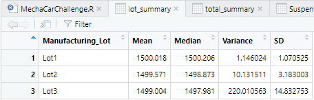

# MechaCar_Statistical_Analysis

## Linear Regression to Predict MPG

- Vehicle Length and Ground Clearance both provide a non-random amount of variance to the MPG values in the dataset with 0.001 significance. The Intercept is also significant at 0.001, which means there are other factors that contribute to the MPG value.
- The slope is not considered to be zero because there are two coefficients involved that are greater than 1
- This model redicts mpg of MechaCar effectively at a 71% rate. This rate is pretty good, but as mentioned above, there are more factors not included in this dataset that can be used to better make a prediction.

## Summary Statistics on Suspension Coils

- Overall the current manufacturing data meets the design specification that the variance of the suspension coils must not exceed a 100 pound variance. When all data is combined, the variance is 76.23.

- However, when the statistics of the lots are calculated separately, only Lots 1 & 2 meet the aforementioned design specification with variances of 1.15 and 10.13 respectively. Lot 3 exceeds the specification with a variance of 220.01 which is more than double the requirement.

# bikesharing

## Overview of Project

### Purpose
To use Tableau to create a story about NYC electronic bike usage, in order to demonstrate the possibilities of recreating the business in a smaller city.

## Results
Complete story is located at [link to dashboard](https://public.tableau.com/profile/shayna6888#!/vizhome/NYCitibikeChallenge/CitibikeStory?publish=yes)
 

Trip duration peaks between 4-6 hours for most users.

The peak of trip duration is the same for both male and females, however there are significantly more male users than female users.

Thursday evenings are the most popular, between 5-6pm. Followed by Thursdays at 8am and Mondays & Tuesdays between 5-6pm.

The busiest usage timeframes for males are consistant with the previous heatmap. For females, it is difficult to determine when they use the bikes most. Taking an attempt, they peak on weekdays from 8-9am, and Mondays/Thursday 5-7pm.

Indicated male users make up nearly 2/3 of total users.

There appears to be more subscribers than regular customers, again, majority males. Subscribers are more active Thursdays and Fridays.

Nearly 80% of trips are taken by subscribers.

## Summary

Overall males are the biggest consumers for this business, and Thursday and Friday evenings are when they have the most activity. Subsciption services are very popular among users which is a good indication of consistant income. If I were to add more visualizations, I would focus on the age range of usage for the Trips taken.