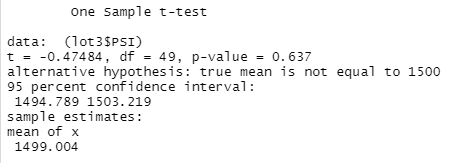

# MechaCar_Statistical_Analysis

## Linear Regression to Predict MPG

- Vehicle Length and Ground Clearance both provide a non-random amount of variance to the MPG values in the dataset with 0.001 significance. The Intercept is also significant at 0.001, which means there are other factors that contribute to the MPG value.
- The slope is not considered to be zero because there are two coefficients involved that are greater than 1
- This model predicts mpg of MechaCar effectively at a 71% rate. This rate is pretty good, but as mentioned above, there are more factors not included in this dataset that can be used to better make a prediction.

## Summary Statistics on Suspension Coils

- Overall the current manufacturing data meets the design specification that the variance of the suspension coils must not exceed a 100 pound variance. When all data is combined, the variance is 76.23.

- However, when the statistics of the lots are calculated separately, only Lots 1 & 2 meet the aforementioned design specification with variances of 1.15 and 10.13 respectively. Lot 3 exceeds the specification with a variance of 220.01 which is more than double the requirement.

## T-Tests on Suspension Coils
- The mean for all of the Manufacturing Lots combined is not significantly different from the population mean of 1,500 pounds per square inch. Therefore we can accept the null hypothesis that the mean PSI is 1500, and we are 95% confident that the PSI in any vehicle will have a PSI between 1498.12 and 1500.94.

- The mean for all of the Manufacturing Lots tested individually were not significantly different from the population mean. Therefore we can accept the null hypothesis that the mean is 1500 for each lot.

## Study Design: MechaCar vs Competition

- A statistical study that I would design to compare MechaCar against competitive vehicles would compare Miles Per Gallon, Horsepower, and Average Engine Life.
- The null hypothesis for each would be that the means between the vehicles are the same, and the alternative hypothesis would be that they are not equal.
- In order to compare the data, we would have to compile data sets of vehicles from 2 or 3 models competitive to MechaCar. Data would need to include Miles Per Gallon, Horsepower, and months before any engine repairs for each individual vehicle in the study.
- I would use a Two-Sample t-Test to determine the hypothesis decision because I am testing means among more than 1 sample.